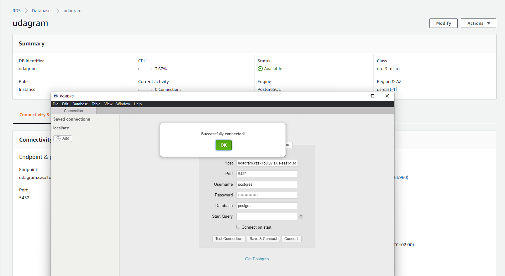
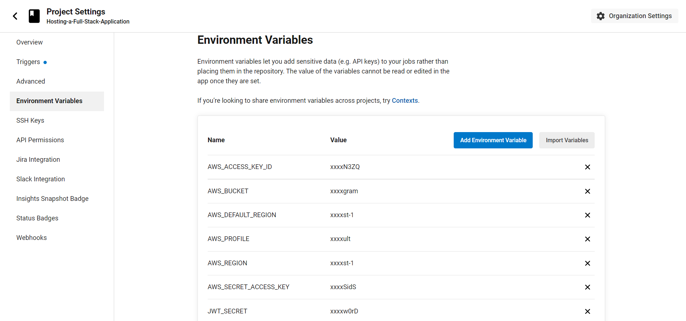

<div align="center">
    <h2>Hosting a Full-Stack Application</h2>
    <p>
        <a href="http://fadl-udagram.s3-website-us-east-1.amazonaws.com/" target="_blank">Live Demo 🡥</a>
    </p>
</div>


---
## Table of Contents

1. [Project Summary](#project-summary)
2. [Dependencies](#dependencies)
3. [Installation](#installation)
    - [Environment Variables](#environment-variables)
4. [Testing](#testing)
5. [Diagrams](#diagrams)
6. [Screenshots](#screenshots)
7. [Built With](#built-with)
8. [Acknowledgements](#acknowledgements)

## Project Summary
In this project, will take a newly developed full stack application and deploy it to a cloud service provider so that it is available to customers. This application contains the main components of a 3-tier full stack application (UI, API, and Database).

I did the following:

- Configure the services and infrastructure on AWS
- Create scripts to deploy each component of the application
- Create and document an automated pipeline using CircleCI

### Dependencies

```
➡ Node v14.15.1 (LTS) or more recent. While older versions can work it is advisable to keep node to latest LTS version

➡ npm 6.14.8 (LTS) or more recent, Yarn can work but was not tested for this project

➡ AWS CLI v2, v1 can work but was not tested for this project

➡ A RDS database running Postgres.

➡ A S3 bucket for hosting uploaded pictures.
```

## Installation

### Clone the Repo
```bash
git clone https://github.com/FADL285/Hosting-a-Full-Stack-Application.git
```

### Environment Variables
Here are the environmental variables that needs to be set in a `.env` file.

This is the default setting that you can use for development.

```dotenv
POSTGRES_USERNAME=postgres
POSTGRES_PASSWORD="YOUR_POSTGRES_PASSWORD"
POSTGRES_HOST=127.0.0.1
POSTGRES_DB=postgres
JWT_SECRET="YOUR_JWT_SECRET"
AWS_BUCKET=""
AWS_REGION=""
AWS_PROFILE=default
URL=127.0.0.1
```

### Install Dependencies
```bash
npm install frontend:install
```
```bash
npm install api:install
```

### Run the Application
```bash
npm run frontend:start
```
```bash
npm run api:start
```

## Testing

This project contains two different test suite: unit tests and End-To-End tests(e2e). Follow these steps to run the tests.

1. `cd udagram/udagram-frontend`
2. `npm run test`
3. `npm run e2e`

There are no Unit test on the back-end

## Diagrams
- **AWS Infrastructure Diagram**


- **Pipeline process Diagram**
[](https://circleci.com/gh/circleci/circleci-docs)


## Screenshots

<div style="display: grid; grid-template-columns: 1fr 1fr; row-gap: 1rem">
    <figure>
        
        <figcaption>➡ App Running Locally</figcaption>
    </figure>
    <figure>
        
        <figcaption>➡ App Running on AWS S3</figcaption>
    </figure>
    <figure>
        
        <figcaption>➡ Testing Postgres Database Connection - RDS</figcaption>
    </figure>
    <figure>
        
        <figcaption>➡ AWS S3 Config with files uploaded</figcaption>
    </figure>
    <figure>
        
        <figcaption>➡ Elastic Beanstalk Status From Console</figcaption>
    </figure>
    <figure>
        
        <figcaption>➡ Elastic Beanstalk Status From CLI</figcaption>
    </figure>
    <figure>
        
        <figcaption>➡ Success CircleCi Pipeline</figcaption>
    </figure>
    <figure>
        
        <figcaption>➡ CircleCi Project Env Variables</figcaption>
    </figure>
</div>

## Built With

- [Angular](https://angular.io/) - Single Page Application Framework
- [Node](https://nodejs.org) - Javascript Runtime
- [Express](https://expressjs.com/) - Javascript API Framework
- [TypeScript](https://www.typescriptlang.org/) - A strongly typed programming language that builds on JavaScript
- [AWS RDS](https://aws.amazon.com/rds/) - Used for create a Postgres database
- [AWS S3](https://aws.amazon.com/s3/) - Used for hosting frontend static files
- [AWS Elastic Beanstalk](https://aws.amazon.com/elasticbeanstalk/) - Used for hosting backend API

## Acknowledgements

➡ [Udacity](https://github.com/udacity)
