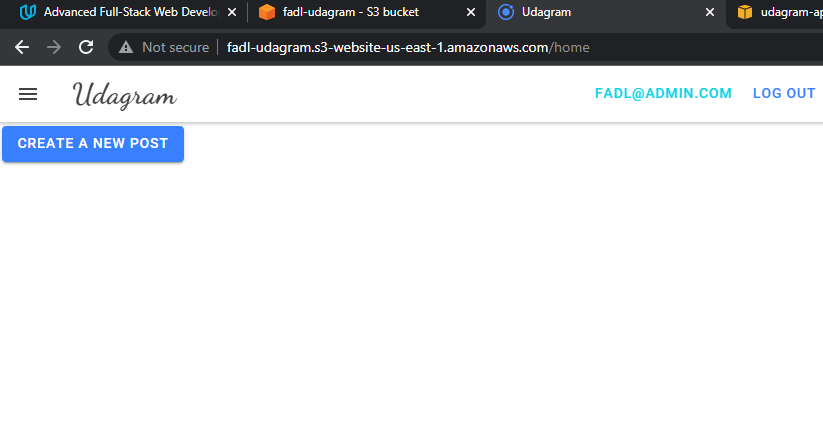

    <h2>Hosting a Full-Stack Application</h2>
    

        <a href="http://fadl-udagram.s3-website-us-east-1.amazonaws.com/" target="_blank">Live Demo 🡥</a>
    

## AWS Infrastructure Diagram

## Steps

1. User request the app that hosted on S3 ➡ [Link Preview](http://fadl-udagram.s3-website-us-east-1.amazonaws.com/)

2. Front-End App request Data From Back-End App which hosted on [Elastic Beanstalk](http://udagram-api-dev.eba-43ppftpt.us-east-1.elasticbeanstalk.com/)

3. Back-End App request Data From Database which hosted on RDS ➡ (udagram.czsx1o8j0vjs.us-east-1.rds.amazonaws.com)

