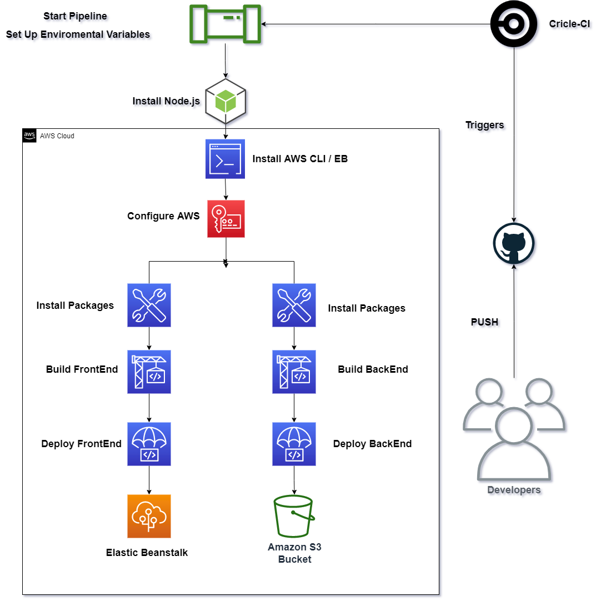
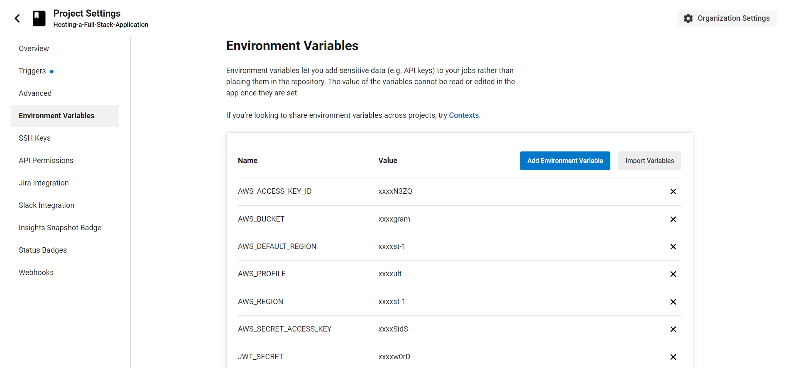
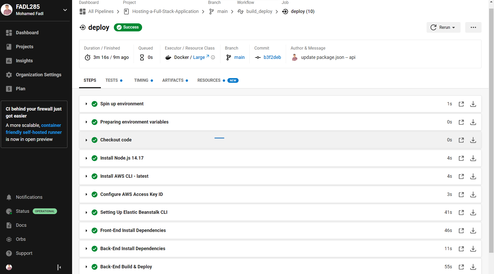

    <h2>Hosting a Full-Stack Application</h2>
    

        <a href="http://fadl-udagram.s3-website-us-east-1.amazonaws.com/" target="_blank">Live Demo 🡥</a>
    

## Continuous Integration

The developers commit code changes to a repository, after which the automated builds and tests are run. Continuous integration refers to the (build and unit testing) stages of the software release process.

Every committed revision triggers an automated build and test.

## Pipeline Architecture

## CircleCI

CircleCI automatically runs the build and test processes whenever the developer commit code, and then displays the build status in the GitHub branch. First step is to create a `config.yml` in the project’s root directory and CircleCI will read it each time it runs a build.

- Frontend: Runs the build script given in the `package.json` file. Then uses AWS CLI to upload assets to S3.
- Server: Runs the build script, exports all environment variables from CircleCI configuration, then runs the archive script. Then uses AWS CLI to upload archive to S3.

### Environment Variables

### CircleCi Success Workflow

